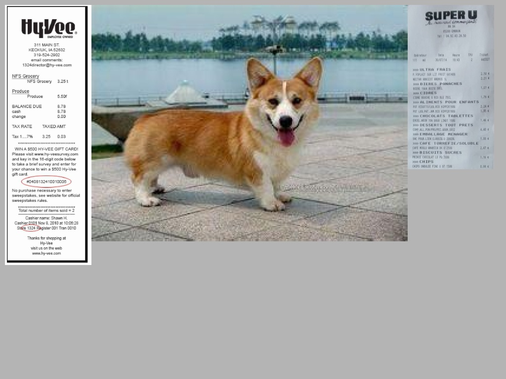

# Image Tailor

Photo by <a href="https://unsplash.com/@bady?utm_source=unsplash&utm_medium=referral&utm_content=creditCopyText">bady abbas</a> on <a href="https://unsplash.com/?utm_source=unsplash&utm_medium=referral&utm_content=creditCopyText">Unsplash</a>

Image tailor is an open source image creator.
Use cut-off, stitching or other method to generate pictures

## Component
Currently, Image Tailor have 3 components:
- `ImagesLoader` Image loader class
- `JigsawPuzzle` Mosaic data augmentation
  - refer: [YOLOv4: Optimal Speed and Accuracy of Object Detection](https://arxiv.org/abs/2004.10934v1)
    - Figure 3: Mosaic represents a new method of data augmentation.
    - 4.2. Influence of different features on Classifier training
    - 7. Acknowledgements [link](https://github.com/ultralytics/yolov3)
- `StickerPlayer` Mixing-and-Pasting Generator

### `ImagesLoader` Image loader
Go through all sub-folders and files specified by root path. Files will be stored as `list`.

:cactus:NOTE：
- `ImagesLoader` will not distinguish whether the file under the path is an image file. User/Developer needs to make sure that the attribute of the file is a picture.  
- Parameter `exclude` will be helpful to let `ImagesLoader` class know what kinds of file should be ignored.

### `StickerPlayer` Mixing-and-Pasting Generator
Randomly select pictures from multiple `ImagesLoader` image loaders passed in by parameters, and perform stitching processing.
- Each `ImagesLoader` object will play as a `bucket`. Backend process will randomly pick up a `bucket`, then, pick up an image from target`bucket`  
- Zoom in/out image
- Copy above result to the output background image follow the rule of `from top to bottom, from left to right`

## Example
All examples are under `src/example`, please refer these code slices as quick start.
