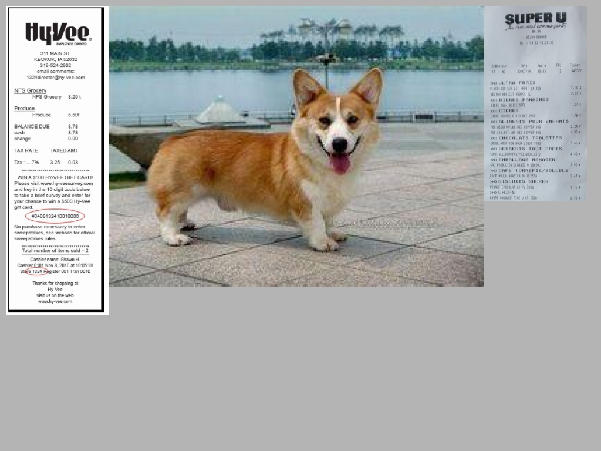
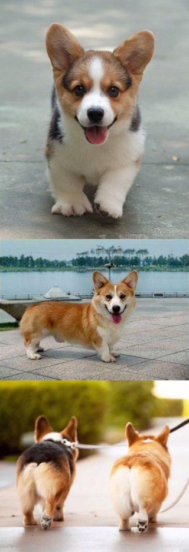

# Image Tailor

Photo by <a href="https://unsplash.com/@bady?utm_source=unsplash&utm_medium=referral&utm_content=creditCopyText">bady abbas</a> on <a href="https://unsplash.com/?utm_source=unsplash&utm_medium=referral&utm_content=creditCopyText">Unsplash</a>

Image tailor 是一个开源图片生成器.
使用剪切、拼接等方式生成图片。

## 组件
Image Tailor包含4个组件：
- `ImagesLoader`图像加载器
- `JigsawPuzzle`马赛克图像增强工具
  - 参考：[YOLOv4: Optimal Speed and Accuracy of Object Detection](https://arxiv.org/abs/2004.10934v1)
    - Figure 3: Mosaic represents a new method of data augmentation.
    - 4.2. Influence of different features on Classifier training
    - 7. Acknowledgements [link](https://github.com/ultralytics/yolov3)
- `StickerPlayer`混合贴图生成器
- `SewingMachine`纵向图片拼接器

### `ImagesLoader`图像加载器
以指定的路径作为起始点，遍历其中的所有文件，结果以`List`的形式呈现。

:cactus:注意：
- `ImagesLoader`不会区分路径下的文件是否是图像文件，用户需要自己确保文件的属性是图片
- 如果需要将某些类型的文件排除在`ImagesLoader`的加载范围之外，请使用`exclude`属性

### `StickerPlayer`混合贴图生成器
从参数传入的多个`ImagesLoader`图像加载器中随机抽选图片，进行拼接处理。
- 每个`ImagesLoader`被视作一个`桶`对象，每次抽选一个`桶`，在从桶中抽取一张图片。
- 将所选图片缩放到指定的大小
- 按照`从上到下，从左到右`的方式将缩放后的结果复制到输出的背景图片中

### `SewingMachine`纵向图片拼接器
从参数传入的`ImagesLoader`图像加载器中顺序读取图片，进行拼接处理。
- `SewingMachine`将会读取`ImagesLoader`对象的`stander_width`属性，
  所有图标均会被自动缩放成`stander_width`所规定的宽度

## Example
使用方法，参考`src/example`下面的例子程序

## TODO
- [ ] Abstract writer
