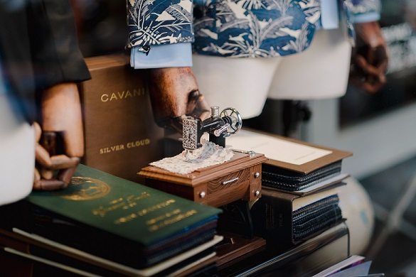

# Image Tailor

Photo by <a href="https://unsplash.com/@bady?utm_source=unsplash&utm_medium=referral&utm_content=creditCopyText">bady abbas</a> on <a href="https://unsplash.com/?utm_source=unsplash&utm_medium=referral&utm_content=creditCopyText">Unsplash</a>

Image tailor 是一个开源图片生成器.
使用剪切、拼接等方式生成图片。

## 组件
Image Tailor包含3个组件：
- `ImagesLoader`图像加载器
- `JigsawPuzzle`马赛克图像增强工具
  - 参考：[YOLOv4: Optimal Speed and Accuracy of Object Detection](https://arxiv.org/abs/2004.10934v1)
    - Figure 3: Mosaic represents a new method of data augmentation.
    - 4.2. Influence of different features on Classifier training
    - 7. Acknowledgements [link](https://github.com/ultralytics/yolov3)
- `StickerPlayer`混合贴图生成器

## Example
使用方法，参考`src/example`下面的例子程序
